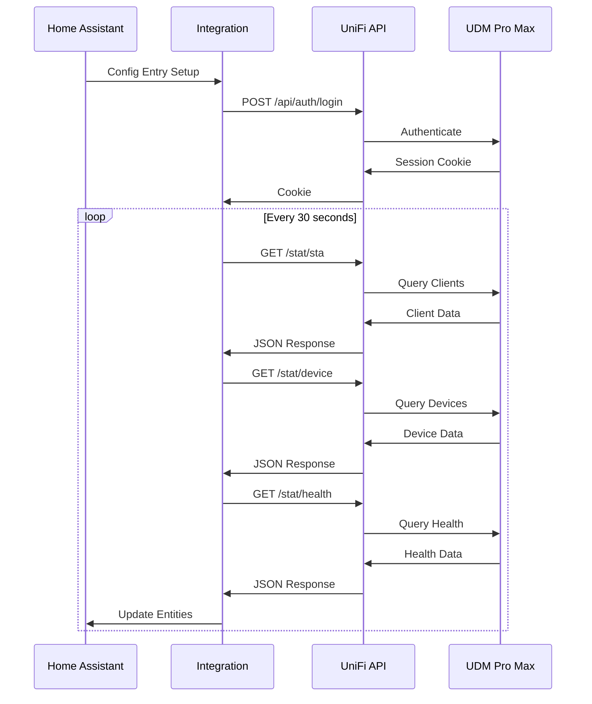

# UniFi API Documentation

This document describes the UniFi Controller API endpoints used by the UniFi Network Pro integration.

## Overview

The integration communicates with the UniFi Controller via HTTPS REST API. The UDM Pro Max exposes these endpoints through the UniFi Network application API.

### Base URL Format

```
https://<controller_ip>/proxy/network/api/s/<site_id>/<endpoint>
```

### Authentication

Uses cookie-based session authentication:

1. POST credentials to `/api/auth/login`
2. Receive session cookie
3. Include cookie in subsequent requests
4. Session expires after inactivity (auto-relogin handled by integration)

## Authentication Endpoints

### Login

**Endpoint**: `/api/auth/login`

**Method**: POST

**Request Body**:
```json
{
  "username": "admin",
  "password": "your_password",
  "remember": true
}
```

**Response** (200 OK):
```json
{
  "meta": {
    "rc": "ok"
  },
  "data": []
}
```

Sets session cookie in response headers.

**Errors**:
- 401: Invalid credentials
- 403: Account locked

### Logout

**Endpoint**: `/api/auth/logout`

**Method**: POST

**Response** (200 OK):
```json
{
  "meta": {
    "rc": "ok"
  },
  "data": []
}
```

## Data Retrieval Endpoints

All data endpoints require authentication (valid session cookie).

### Get Active Clients

**Endpoint**: `/proxy/network/api/s/{site}/stat/sta`

**Method**: GET

**Description**: Returns all active (connected) clients on the network.

**Response Structure**:
```json
{
  "meta": {
    "rc": "ok"
  },
  "data": [
    {
      "mac": "aa:bb:cc:dd:ee:ff",
      "ip": "192.168.1.100",
      "hostname": "johns-laptop",
      "name": "John's Laptop",
      "oui": "Apple",
      "os_name": "macOS",
      "is_wired": false,
      "is_guest": false,
      "essid": "HomeNetwork",
      "channel": 36,
      "signal": -42,
      "noise": -95,
      "rx_bytes": 1234567890,
      "tx_bytes": 987654321,
      "rx_rate": 866700,
      "tx_rate": 866700,
      "uptime": 3600,
      "last_seen": 1699564800,
      "ap_mac": "aa:bb:cc:dd:ee:11",
      "connection": "wireless"
    }
  ]
}
```

**Key Fields**:

| Field | Type | Description |
|-------|------|-------------|
| `mac` | string | Device MAC address (unique identifier) |
| `ip` | string | Current IP address |
| `hostname` | string | Device hostname |
| `name` | string | Friendly name (if set) |
| `oui` | string | Manufacturer (from MAC OUI) |
| `os_name` | string | Detected operating system |
| `is_wired` | boolean | True if connected via ethernet |
| `essid` | string | WiFi SSID (if wireless) |
| `channel` | integer | WiFi channel (if wireless) |
| `signal` | integer | Signal strength in dBm (if wireless) |
| `rx_bytes` | integer | Total bytes received |
| `tx_bytes` | integer | Total bytes transmitted |
| `uptime` | integer | Connection duration in seconds |
| `last_seen` | integer | Unix timestamp of last activity |
| `ap_mac` | string | Access point MAC (if wireless) |

### Get Network Devices

**Endpoint**: `/proxy/network/api/s/{site}/stat/device`

**Method**: GET

**Description**: Returns all UniFi network devices (APs, switches, gateways).

**Response Structure**:
```json
{
  "meta": {
    "rc": "ok"
  },
  "data": [
    {
      "_id": "507f1f77bcf86cd799439011",
      "mac": "aa:bb:cc:dd:ee:22",
      "type": "udm",
      "model": "UDMPRO",
      "name": "Dream Machine Pro",
      "version": "7.5.176",
      "state": 1,
      "uptime": 864000,
      "system-stats": {
        "cpu": 15.5,
        "mem": 42.3,
        "uptime": 864000
      },
      "stat": {
        "rx_bytes": 9876543210,
        "tx_bytes": 1234567890,
        "wan-rx_bytes": 5555555555,
        "wan-tx_bytes": 4444444444
      },
      "wan1": {
        "ip": "203.0.113.10",
        "gateway": "203.0.113.1",
        "netmask": "255.255.255.0",
        "up": true
      }
    }
  ]
}
```

**Key Fields for UDM Pro Max**:

| Field | Type | Description |
|-------|------|-------------|
| `type` | string | Device type ("udm" for Dream Machines) |
| `model` | string | Exact model (UDMPRO, UDMSE, etc.) |
| `uptime` | integer | Device uptime in seconds |
| `system-stats.cpu` | float | CPU usage percentage |
| `system-stats.mem` | float | Memory usage percentage |
| `stat.wan-rx_bytes` | integer | WAN total downloaded bytes |
| `stat.wan-tx_bytes` | integer | WAN total uploaded bytes |
| `stat.rx_bytes` | integer | LAN total received bytes |
| `stat.tx_bytes` | integer | LAN total transmitted bytes |
| `wan1.ip` | string | Public WAN IP address |

### Get System Health

**Endpoint**: `/proxy/network/api/s/{site}/stat/health`

**Method**: GET

**Description**: Returns health status of various network subsystems.

**Response Structure**:
```json
{
  "meta": {
    "rc": "ok"
  },
  "data": [
    {
      "subsystem": "wan",
      "status": "ok",
      "num_user": 0,
      "num_guest": 0,
      "num_iot": 0,
      "latency": 12,
      "uptime": 864000,
      "speedtest_status": {
        "xput_download": 500.5,
        "xput_upload": 50.2,
        "latency": 12,
        "time": 1699564800
      }
    },
    {
      "subsystem": "lan",
      "status": "ok",
      "num_user": 25
    },
    {
      "subsystem": "wlan",
      "status": "ok",
      "num_user": 15,
      "num_guest": 2
    }
  ]
}
```

**Subsystems**:

| Subsystem | Description |
|-----------|-------------|
| `wan` | Internet connection |
| `lan` | Local area network |
| `wlan` | Wireless network |
| `vpn` | VPN connections |
| `www` | Internet accessibility |

**Health Fields**:

| Field | Type | Description |
|-------|------|-------------|
| `status` | string | "ok", "warning", or "error" |
| `latency` | integer | WAN latency in milliseconds |
| `speedtest_status.xput_download` | float | Download speed in Mbps |
| `speedtest_status.xput_upload` | float | Upload speed in Mbps |
| `num_user` | integer | Number of users on subsystem |

### Get System Info

**Endpoint**: `/proxy/network/api/s/{site}/stat/sysinfo`

**Method**: GET

**Description**: Returns detailed system information.

**Response Structure**:
```json
{
  "meta": {
    "rc": "ok"
  },
  "data": [
    {
      "hostname": "UDMPRO",
      "ip_addrs": ["192.168.1.1"],
      "version": "7.5.176",
      "build": "7.5.176.0.1",
      "uptime": 864000,
      "timezone": "America/Los_Angeles"
    }
  ]
}
```

## Integration Data Flow



## Data Mapping

### Sensor Entity Mappings

| Sensor Entity | API Source | Field Path |
|---------------|------------|------------|
| `connected_clients` | `/stat/sta` | `len(data)` |
| `cpu_usage` | `/stat/device` | `system-stats.cpu` |
| `memory_usage` | `/stat/device` | `system-stats.mem` |
| `uptime` | `/stat/device` | `uptime` |
| `wan_ip` | `/stat/device` | `wan1.ip` |
| `wan_rx_bytes` | `/stat/device` | `stat.wan-rx_bytes` |
| `wan_tx_bytes` | `/stat/device` | `stat.wan-tx_bytes` |
| `lan_rx_bytes` | `/stat/device` | `stat.rx_bytes` |
| `lan_tx_bytes` | `/stat/device` | `stat.tx_bytes` |
| `wan_download_mbps` | `/stat/health` | `speedtest_status.xput_download` |
| `wan_upload_mbps` | `/stat/health` | `speedtest_status.xput_upload` |
| `wan_latency` | `/stat/health` | `latency` |

### Device Tracker Attributes

| Attribute | API Source | Field |
|-----------|------------|-------|
| `mac` | `/stat/sta` | `mac` |
| `ip` | `/stat/sta` | `ip` |
| `hostname` | `/stat/sta` | `hostname` |
| `connection_type` | `/stat/sta` | `connection` |
| `wifi_network` | `/stat/sta` | `essid` |
| `signal_strength` | `/stat/sta` | `signal` |
| `rx_bytes` | `/stat/sta` | `rx_bytes` |
| `tx_bytes` | `/stat/sta` | `tx_bytes` |
| `uptime` | `/stat/sta` | `uptime` |

## Rate Limiting

The UniFi Controller has built-in rate limiting:

- Recommended polling interval: 30-60 seconds
- Maximum concurrent connections: Varies by device
- Failed login attempts: 5 per 5 minutes (account lockout)

## Error Handling

### HTTP Status Codes

| Code | Meaning | Integration Handling |
|------|---------|---------------------|
| 200 | Success | Parse and process data |
| 401 | Unauthorized | Attempt re-login |
| 403 | Forbidden | Log error, notify user |
| 404 | Not Found | Check endpoint/site ID |
| 429 | Too Many Requests | Back off, increase interval |
| 500 | Server Error | Retry after delay |
| 503 | Service Unavailable | Mark entities unavailable |

### Session Management

Sessions expire after ~30 minutes of inactivity. The integration:

1. Detects 401 responses
2. Automatically calls `/api/auth/login`
3. Retries the original request
4. Updates session cookie

## API Differences by Model

Different UniFi devices may expose different data:

| Feature | UDM Pro | UDM Pro Max | UDM SE |
|---------|---------|-------------|--------|
| Basic Stats | Yes | Yes | Yes |
| WAN Speed | Yes | Yes | Yes |
| System Stats | Yes | Yes | Yes |
| Port Stats | Limited | Yes | Yes |
| Multi-WAN | No | Yes | Yes |

## Testing API Access

### Using curl

```bash
# Login
curl -k -X POST https://192.168.1.1/api/auth/login \
  -H "Content-Type: application/json" \
  -d '{"username":"admin","password":"pass","remember":true}' \
  -c cookies.txt -v

# Get clients
curl -k https://192.168.1.1/proxy/network/api/s/default/stat/sta \
  -b cookies.txt | jq .

# Get devices
curl -k https://192.168.1.1/proxy/network/api/s/default/stat/device \
  -b cookies.txt | jq .

# Get health
curl -k https://192.168.1.1/proxy/network/api/s/default/stat/health \
  -b cookies.txt | jq .
```

### Using Python

```python
import aiohttp
import asyncio
import json

async def test_api():
    async with aiohttp.ClientSession() as session:
        # Login
        login_url = "https://192.168.1.1/api/auth/login"
        login_data = {
            "username": "admin",
            "password": "password",
            "remember": True
        }

        async with session.post(login_url, json=login_data, ssl=False) as resp:
            print(f"Login: {resp.status}")

        # Get clients
        clients_url = "https://192.168.1.1/proxy/network/api/s/default/stat/sta"
        async with session.get(clients_url, ssl=False) as resp:
            data = await resp.json()
            print(f"Clients: {json.dumps(data, indent=2)}")

asyncio.run(test_api())
```

## Security Considerations

1. **HTTPS Only**: All communication is encrypted
2. **Session Cookies**: Secure, HTTPOnly flags set
3. **Local Network**: API not exposed to internet by default
4. **Firewall**: Configure rules to restrict API access
5. **Strong Passwords**: Use complex passwords for UniFi accounts
6. **Certificate Validation**: Enable SSL verification in production

## Further Reading

- [UniFi Controller API Documentation](https://ubntwiki.com/products/software/unifi-controller/api)
- [UniFi API Browser](https://github.com/Art-of-WiFi/UniFi-API-browser)
- [UniFi Network API](https://dl.ui.com/unifi/7.5/UniFi-API.html)

## API Version Compatibility

| Controller Version | API Version | Compatibility |
|-------------------|-------------|---------------|
| 7.0.x | v1 | Full |
| 7.1.x - 7.3.x | v1 | Full |
| 7.4.x - 7.5.x | v1 | Full (Current) |
| 8.0.x+ | v1/v2 | Testing required |

The integration is tested against UniFi Network 7.5.x but should work with 7.0.x and newer.
